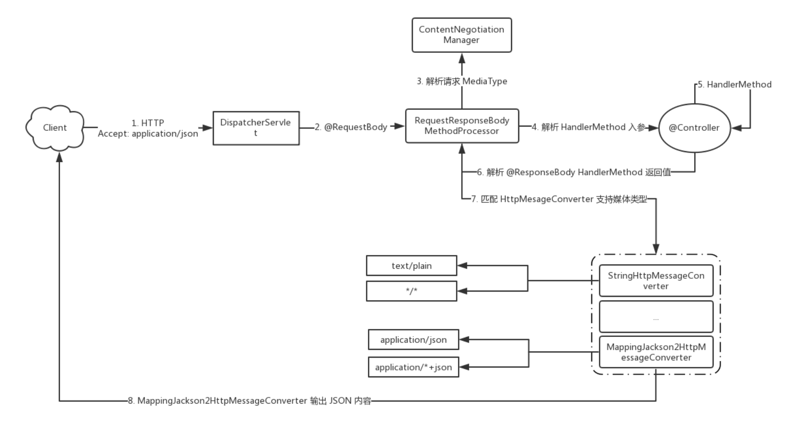

# spring mvc Content negotiation 内容協商

## 核心组件
- 视图解析
  - ContentNegotiatingViewResolver
    - InternalResourceViewResolver
    - BeanNameViewResolver
    - ThymeleafViewResolver
- 配置策略
  - 配置 Bean： WebMvcConfigurer
  - 配置对象： ContentNegotiationConfigurer
- 策略管理
  - Bean： ContentNegotiationManager 
  - FactoryBean ： ContentNegotiationManagerFactoryBean
- 策略实现
  - ContentNegotiationStrategy
    - 固定 MediaType ： FixedContentNegotiationStrategy 
    - "Accept" 请求头： HeaderContentNegotiationStrategy
    - 请求参数： ParameterContentNegotiationStrategy
    - 路径扩展名： PathExtensionContentNegotiationStrategy


## 核心代码
### 测试代码
```
# web 内容协商
curl -i -H "Accept-Language:zh-CN,zh;q=0.9" -H "Accept:text/html"  http://localhost:8080/web/hello
curl -i -H "Accept-Language:zh-CN,zh;q=0.9" -H "Accept:application/xml"  http://localhost:8080/web/hello
```

# spring rest Content negotiation 内容協商

## 核心流程


这个流程图有个前提，是参数使用 @RequestBody，返回值使用 @ResponseBody。
从核心流程中我们看到 RequestResponseBodyMethodProcessor 及处理请求参数也处理响应。


从图中可以看到 RequestResponseBodyMethodProcessor 实现了 HandlerMethodArgumentResolver 和 HandlerMethodReturnValueHandler 两个接口，所以在这个特定的流程中，RequestResponseBodyMethodProcessor 处于流程的核心位置。

```
rest 内容协商

curl -X POST -i -H "Content-Type:application/json" --data '{"id":21,"name":"内容"}' http://localhost:8080/web/echo/user 
curl -X POST -i -H "Content-Type:application/json" -H "Accept:application/json" --data '{"id":21,"name":"内容"}' http://localhost:8080/web/echo/user 
```

# spring Content negotiation 内容協商自定义媒体类型
```
自定义 PropertyMessageConvertor
curl -X POST -i -H "Content-Type:text/properties" -d $'id=1\nname=内容' http://localhost:8080/web/props
```
